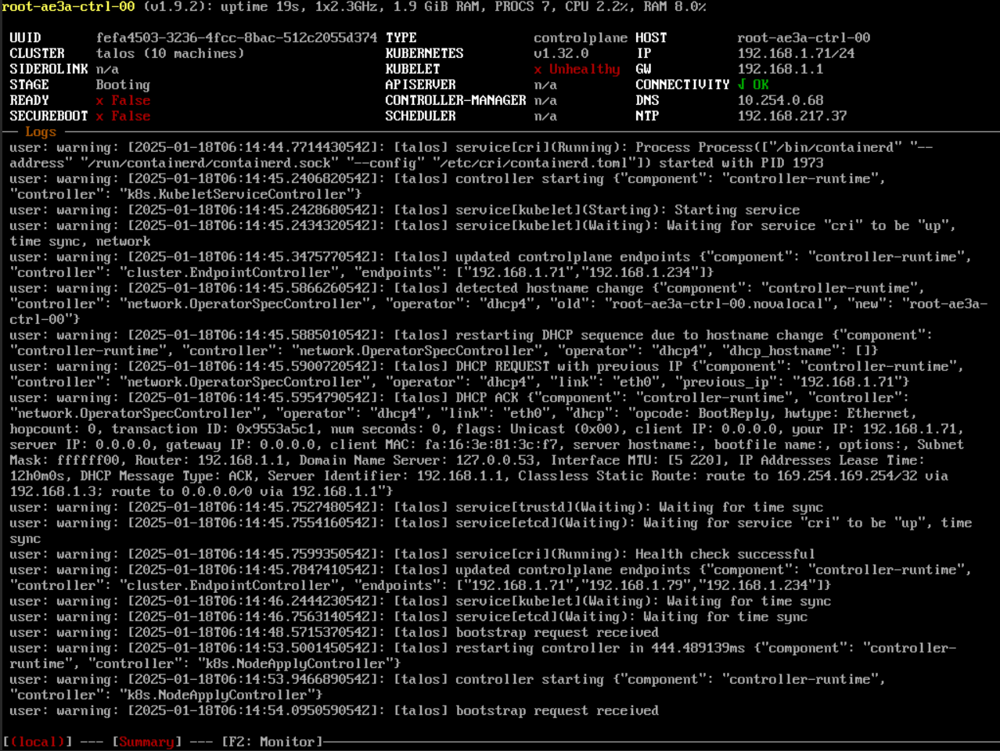
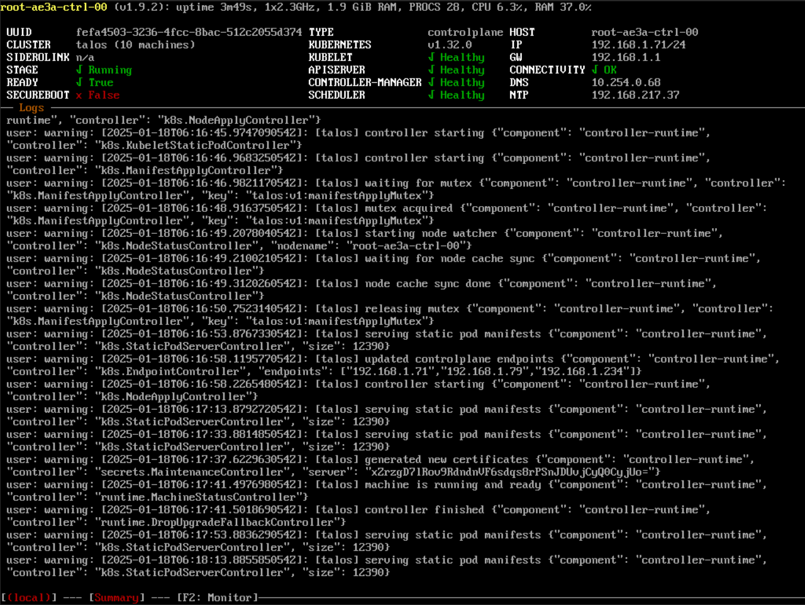
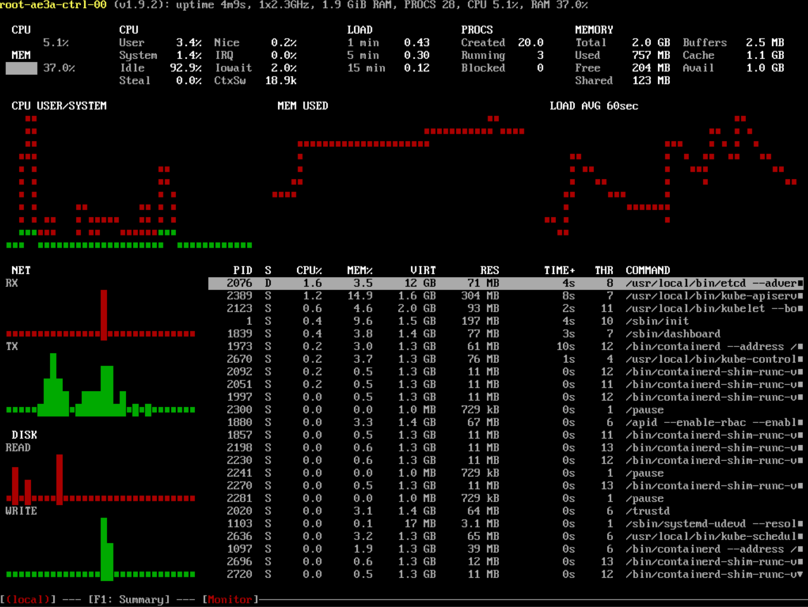
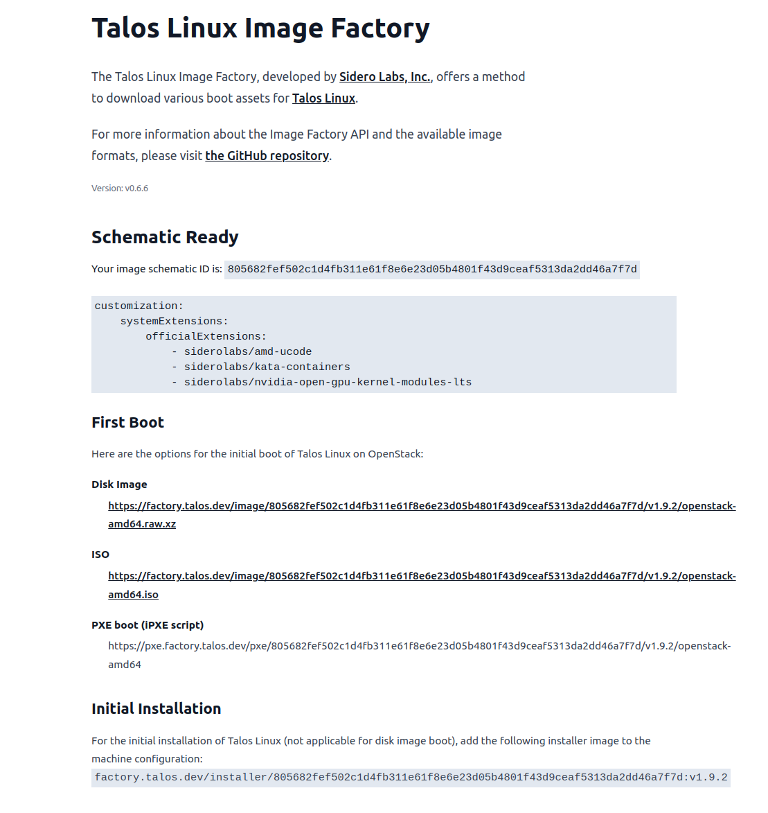

# Talos
* Linux distribution with the sole purpose of running kubernetes
* one yaml file for complete os configuration
* pretty lightweight, whole userland rewrite, including systemd replacement, focus on security
* no shell, no ssh
* MPL-2.0 license

### Links
* [Machine configuration](https://www.talos.dev/v1.9/reference/configuration/v1alpha1/config/)
* [Member discovery](https://www.talos.dev/v1.9/talos-guides/discovery/)

# Member discovery
The discovery service must be available so that the cluster can find all its members.

Run service:
```
docker run -d -p 3000:3000 ghcr.io/siderolabs/discovery-service:v1.0.9
```

# Setup with Terraform
* [Openstack](openstack-talos/README.md)

# Setup manually
* setup
    * all talos nodes are running in maintenance mode and all related IPs are known
    * the url (http://$DISCOVERY_FLOATING_IP:3000) of the discovery service is known
* get talos
    ```
    wget -O talosctl https://github.com/siderolabs/talos/releases/download/v1.9.1/talosctl-linux-amd64 && \
        chmod +x talosctl && \
        export PATH=$PATH:$(pwd)
    ```
* generate config
    ```
    CONTROLPLANE_IP=$OPENSTACK_FLOATING_IP

    talosctl gen config talos-manual https://$CONTROLPLANE_IP:6443 --output talos-config && \
        export TALOSCONFIG=$(pwd)/talos-config/talosconfig
    ```
*   extend both worker and controlplane config by the discovery service endpoint
    ```
    cluster:
      discovery:
        enabled: true
        registries:
          service:
            endpoint: http://$DISCOVERY_FLOATING_IP:3000
    ```
* apply config to all control-plane and worker nodes
    ```
    talosctl apply-config --insecure -n $CONTROLPLANE_IP --file talos-config/controlplane.yaml
    talosctl apply-config --insecure -n $WORKER_IP --file talos-config/worker.yaml
    ```
* bootstrap the cluster
    ```
    talosctl bootstrap --nodes $CONTROLPLANE_IP --endpoints $CONTROLPLANE_IP
    ```

### Check Talos is running
* run health check and dashboard
    ```
    export TALOSCONFIG=$(pwd)/talos-config/talosconfig
    CONTROLPLANE_IP=$OPENSTACK_FLOATING_IP

    talosctl --nodes $CONTROLPLANE_IP --endpoints $CONTROLPLANE_IP health
    talosctl dashboard
    ```

### Check kubernetes is running and workloads are schedulable
* get kubectl
    ```
    wget https://dl.k8s.io/release/v1.32.0/bin/linux/amd64/kubectl && \
        chmod +x kubectl && \
        export PATH=$PATH:$(pwd)
    ```
* export kubeconfig and start a nginx container
    ```
    talosctl kubeconfig $(pwd)/talos-config/kubeconfig && \
        export KUBECONFIG=$(pwd)/talos-config/kubeconfig

    kubectl run pod/nginx --image nginx
    kubectl get pods
    ```

## Troubleshooting
* start debug container: `kubectl debug -n kube-system -it --image alpine node/$NODE`

## Screenshots



